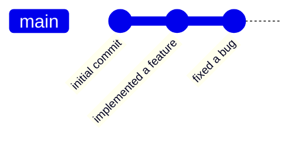
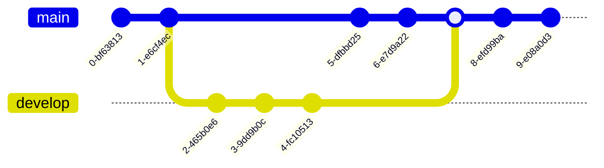

# "Syllabus"

- polls
- introduction
- installing git and bash
- navigation in bash
- common bash utilities
- pipes, redirects
- absolute basics of vim
- basic introduction to git: cloning, staging, commiting, pushing, pulling
- working with multiple people in the same git repository
- GitHub-specific tools: pull requests, CI/CD


# Quick Poll:

- which operating system are you currently using? (Mac, Windows, Linux)
- have you used a terminal (bash, zsh, fish, cmd, PowerShell) before?
- have you used an sh-compatible terminal before?
- have you used git or github before?


# Introduction

Some definitions:

- an **Operating System** is software that manages software and other hardware for a computer, and provides common services. 
	- MacOS, Windows, Android, iOS, and the various Linux distributions (Ubuntu, Mint, Arch, etc) are all operating systems
- a **command-line shell** is a program that interprets a language that allows the user to have access to operating system services
	- these services include moving files around, running or stopping other programs, and pretty much anything you can expect to be able to do with a computer
- a **version control system** is responsible for tracking and managing changes to source code and programs. when working on all but the smallest pieces of code, this becomes extremely useful. Think of it as google docs edit history, but for source code
	- the only version control system that you should worry about learning is git -- for now, all others see relatively niche application in industry

Now, some history:

- "Unix" is a family of operating systems, originating from Bell Labs in 1969
- the GNU project (a recursive acronym standing for "GNU's not Unix!") was created in 1983 with the goal of giving computer users freedom in their use of computing devices. it has created a wide variety of open-source tools, including bash (Bourne-again shell) in 1989 to replace the original Bourne shell for Unix
- "Linux" is a family of open-source "unix-like" operating systems, and most "serious" computing is done on Linux today.
- "git" is a version control system originally created to manage the development of the Linux kernel, but has been widely adopted in all areas of software and is the de-facto standard for version control


# Installing bash and git

if you're prompted during installation to select a default text editor for editing commits, I reccomend `nano`, but feel free to choose whatever you're comfortable with

## MacOS

- MacOS comes with either bash or zsh, depending on how recently you've updated. simply start up the "Terminal" program
- to install git, go to [git-scm.com](https://git-scm.com)

## Windows

Windows comes with both the `cmd` shell and PowerShell, but you'll want to install bash. Navigate to [gitforwindows.org](https://gitforwindows.org), and download and run the installer.

> NOTE: When prompted about line endings, select "Check out as-is, commit LF"


when the installation is complete, start up "git bash" from the start menu


## Linux

Almost all distributions of Linux come with bash or some other sh-compatible shell, and git.


## testing

after installing, launch your terminal, type
```bash
git --version
```
and hit enter. It should print the version to the console.


now, type
```bash
help
```

this should:

- tell you what shell you're using
- remind you how to use help commands
- give the basic keywords of your shell language


# Bash Basics

firstly, note that:

- [stackoverflow](https://stackoverflow.com) is your friend!
- adding `--help` to almost any command will display a help message explaining how to use it
- `*` is commonly used as a "wildcard" -- it will "match" any character or string of characters
- text in curly braces `{}` will be used to mean "replace this with text relevant to your usage"
	- for example, `cd {path}` changes your directory, but you should replace `{path}` with an actual path, such as `Downloads`
	- curly braces *do* have their own special meaning in bash, so be careful (array construction, parameter expansion, and output grouping. those are beyond the scope of this tutorial)
- if you get stuck in what looks like a text editor, its probably either `less` or `vim`. try:
	- pressing `q` (this exists `less`)
	- pressing `esc`, then `:`, then `q` (this exits vim)[^1]

[^1]: [see here](https://twitter.com/ctrlshifti/status/1282199281982533637)


## control

- `ctrl+C` will close the current process
- `ctrl+Z` will pause the current command, resume it in the background or foreground with `fg` or `bg` respectively
- `TAB` will try to autocomplete a command or file
- $\uparrow$ (up arrow key) will bring up the most recent command
- `ctrl+R` will search among the previous commands (this is *very* useful)
- `ctrl+A` and `ctrl+E` will bring the cursor to the start or end of the line, respectively

## navigation & file management

when you run commands, it is usually important which files are around. these commands let you move around in and modify the filesystem

- `pwd` will **p**rint the **w**orking **d**irectory (your current location in the filesystem)
- `ls`: **l**i**s**t every file/folder in the current directory
	- `ls -al` will print it in a list format with some more data about the file, notable the filesize in bytes and the date on which it was last modified
	- note that `.` means "the current directory" and `..` means "the parent directory"
- `cd {path}` will **c**hange **d**irectory to the specified path

- `mkdir {path}` will create a directory at the given path
- `rm` will **r**e**m**ove a file (be careful!!)
	- `rm -rf` will remove a directory and its contents
- `cp {path1} {path2}` and `mv {path1} {path2}` will **c**o**p**y or **m**o**v**e the files specified in `{path1}` to `{path2}`, respectively.  
	you can do really clever things too, like copy the contents of a directory:  
  - `cp *.txt textfiles/` will copy all files ending in `.txt` into the folder `textfiles`
  - `cp -R data moredata` will copy the contents of the folder `data`

- `find -name {name}` will find all files matching `{name}`


## flow direction

in the unix philosophy, programs should input and output streams of text. 

- a program can read input from `stdin`, which is equivalent to prompting the user for some text
- a program writes its output to `stdout`
- a program writes any errors or warnings to `stdin`

For modern software, this isn't always the dominant paradigm, but it can still come in handy. The following commands can be used redirecting the outputs of a program:

- `>` redirects the `stdout` of the preceeding command into the file following the sign. *this will overwrite any existing file*
	- note that anything still printed to the console is from `stderr`
- `2>` redirects `stderr` to the given file
	- can be used in combination with `>`:  
	`myprogram > output.txt 2> errors.txt`
- `>>` appends the `stdout` of the preceeding command to the specified file, leaving the existing contents in place
- `|` will send `stdout` of the preceeding command as `stdin` to the following command


## utilities

bash has many built-in programs, there are many thousands you can install, and you can even write your own. here are a few I find myself using regularly.

- `cat {file}` will print the contents of a text file to the console. only useful alone for short files
	- `cat {file} | less` will open a simple viewer, press `q` to exit
		- (more on what `|` does later)
	- `head {file} -n {number}` or `tail {file} -n {number}` will print `{number}` lines from the beggining or end of the specified file, respectively
- `diff {file1} {file2}` will give the difference between two text files
- `grep {text} [filename]` will return lines from `[filename]` with `{text}` in them
	- this is most useful when searching for something in a file:  
    `cat my_logfile.txt | grep "WARNING"`
- `tar` combines multiple files into a "tarball", which is a single file that contains multiple files within it. usage can be complicated
	- compressing: `tar -zcvf compressed_files.tar.gz folder/`
	- decompress: `tar -zcvf compressed_files.tar.gz folder/` 
- `gzip` compresses a single file
- `nano {filename}` opens the `nano` text editor on a file
	- `nano` helpfully has instructions on the bottom for how to use it, so you're less likely to get stuck
	- this is very useful for editing text files when you're connected to a big supercomputer without a desktop


## basic scripting

any command you can run in the command line, you can put in a file

- printing to console: use `echo "{stuff}"`
- using variables: all variables in bash are strings. it's a bit weird.
	- define using `VARNAME="stuff"`
	- use later by writing `$VARNAME`
- referencing command line args: in general, `$1` is the first arg, `$2` is the second, and so on
- control flow: 
	- if-then blocks generally look like
		```bash
		if {command}; then
			{code}
		fi
		```
		but the `{command}` can take many forms. `"$VARNAME" == "test"` will evaluate to true, but you can test for the existence of files and do many other things
	- for loops: look them up if you must

a simple example script:
```bash
echo "you are located in:"
pwd

dirname=$1
searchname=$2

echo "we will create and enter the directory $dirname"

mkdir $dirname -p
cd $dirname

fname="programs-$(date +%s).txt"
ps > $fname

cat $fname | grep $searchname
```


## system utilities

a few commands for interacting with your operating system  
> note: these work on linux/wsl, some will work on windows with git bash, and I have no idea if they work on macOS)

- `ps` static process list
- `kill {PID}` kill a process with the given id (use `ps` to get the id)
- `fg` and `bg` move a process to the foreground or background
- `top` dynamic process list, will keep updating until you do `ctrl+C`
	- `htop` will also display cpu utilization. useful for seeing if your code is actually properly parallelized, and also for looking kinda cool
- `sudo {command}` **DANGEROUS:** this is "superuser" mode, which will let you do very dangerous things and possible brick your computer. use with **extreme** caution. using it on a cluster probably won't work and might get you in trouble


# using Git

git is a distributed version control system. what does "git" stand for? the readme of the source code states:

> "git" can mean anything, depending on your mood.
> 
> - Random three-letter combination that is pronounceable, and not actually used by any common UNIX command. The fact that it is a mispronunciation of "get" may or may not be relevant.
> - Stupid. Contemptible and despicable. Simple. Take your pick from the dictionary of slang.
> - "Global information tracker": you're in a good mood, and it actually
> - works for you. Angels sing, and a light suddenly fills the room. 
> - "Goddamn idiotic truckload of ****": when it breaks.


## why use git?

git, used properly, will make sure that you never, ever, ever end up in a situation where you lose code. If you make changes to your code, you can go back in the commit history and find the last working version. if you accidentally delete everything, git will let you recover it. if your computer gets blown up, your code is backed up. If you're working on a collaborative project, git will help you resolve issues when you and your collaborators modify code at the same time.


## basics

git is supposed to be simple, but can often feel anything but. Here are the 7 absolute basic commands you need to know:

- `git help` ...prints help
	- note the commands: `git help tutorial`, `git help everyday`, `git help workflows`
- `git clone {url} {folder}` clones the git repo at `{url}` into `{folder}`
	- `{url}` is usually a github link like `https://github.com/someuser/repositoryname`
	- if `{fname}` is not given, it will clone into a directory with the name `{repositoryname}`
- `git status` shows you what's going on in the current repository
- `git add {files}` "stages" files (selects them for being commited)
- `git commit` "commits" your changes -- they are now added to the official list of changes
- `git pull` synchronizes your client by pulling files from the remote
- `git push` sends whatever changes you have commited to the remote


## details

A "git repository" is a directory in which certain files are *tracked* by git. when you run any `git` command, it looks for a `.git` file in the current directory, and recursively in every parent directory. that folder contains the whole history of all changes you've commited to the repository.

Your local history can synchronize with a "remote" repository[^2] -- this is the primary way of backing up your code, and collaborating with others. GitHub, GitLab, BitBucket, and other websites provide (free) hosting of git repositories. We will be using GitHub in this tutorial.

[^2]: if you want to start a local-only git repository, you can run `git init` in a repository. this will create a `.git` folder, and start tracking changes. If you then want these to then be synced with the cloud, you will need to use `git remote add origin {url}`. for this tutorial, we assume the creation of a repository on github first]

- When you make changes, git does not automatically do anything
- To track changes, you must first add them using `git add {files}` (`git add .` will add everything in the current directory)
	- you can exclude files via a special `.gitignore` file, which you may look up the documentation for. this is useful if you have built binaries that you dont want to upload, have files with API or SSH keys you don't want to make public, or have a bunch of data that you don't want to upload.
- When you run `git status`, it will show you which changes have been added and which have not
- when you run `git commit`, it will add all the changes along with your message to a "tree"




### branching

When you're working on code with other people, want a persistent version of your code that is always functional, or otherwise need multiple versions of your code, branches are your friend. Git handles history as a "tree", where the main trunk is called `main` (somtimes `master` on older systems), and you can branch off at any commit. After making changes, you can then re-merge the branch




key commands:

- `git branch` see the active branches
- `git branch {name}` create a new branch
- `git checkout {name}` switch to a branch

merging branches in the command line is possible, but I'll be covering how to do it in the github client


## github

Github is a platform for hosting git repositories. It is free, and has a lot of features. You can find other peoples's code, "fork" it (make a copy that belongs to you), make changes, and then merge your changes into the original repository. It also acts as a sort of social network for anything code-related, and having some open source projects up on your github can be a great way to stand out to employers.

The main thing to know about what github adds is **Pull Requests**:  
A pull request "pulls" changes from one branch onto another branch -- this terminology can be confusing, but in the interface the "source" branch is on the right and the "target" branch is on the left.

Github also supports various CI/CD features, which let you automatically run code upon certain actions, like creating a pull request to the main branch. These are beyond the scope of this bootcamp, but I'm happy to chat about them sometime.


## branches


# Assignment

(try to do this all in the command line)

1. install bash and git, if you haven't already
2. go to [github.com](https://github.com) and create an account if you don't have one
	3. log in to github on your system. this will vary depending on your OS, and you may have to generate a token on the website
4. fork and clone your fork of the repository [https://github.com/mivanit/bash-git-bootcamp](https://github.com/mivanit/bash-git-bootcamp)
5. change to the "user-dev" branch
6. navigate to the "userdata" folder
7. create and enter folder with your mines username
8. make some changes here -- write a script, add a file, whatever you want
9. add, commit, and push your changes
10. merge your changes with the `user-dev` branch on my repository


# Takeaways

- bash is useful for talking to computers and manipulating filesystems at scale
- git and github will prevent you from ever losing your code


# Resources

- [git docs](https://git-scm.com/doc)
- [bash docs](https://devdocs.io/bash/)
- [bash cheat sheet](https://oit.ua.edu/wp-content/uploads/2020/12/Linux_bash_cheat_sheet-1.pdf) (there are many online)
- [pandoc](https://pandoc.org/MANUAL.html)
- how to use git in the command line is good to know, but there are many graphical interfaces for it. I reccomend [GitHub Desktop](https://desktop.github.com) 


